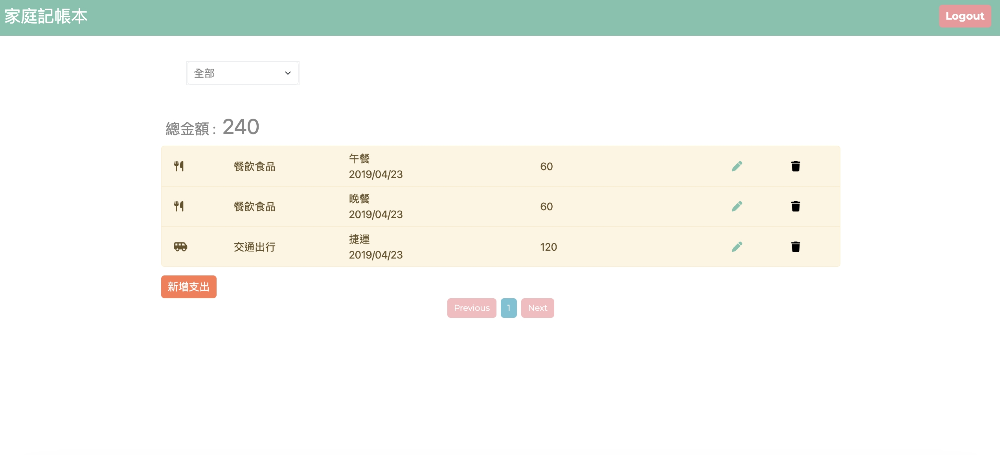
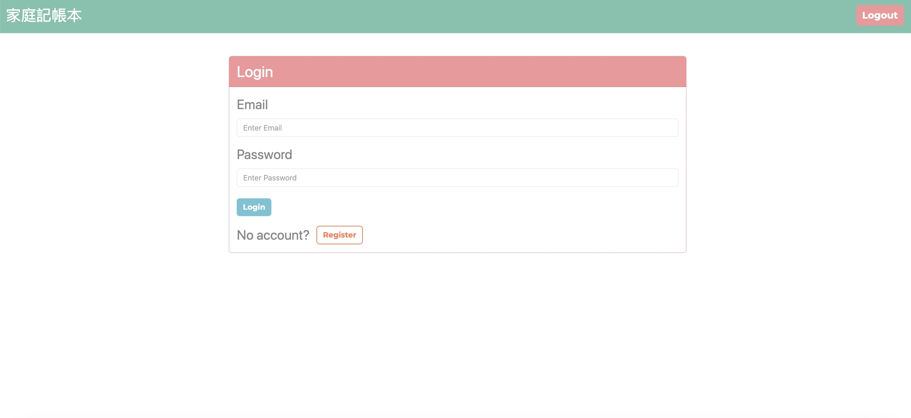
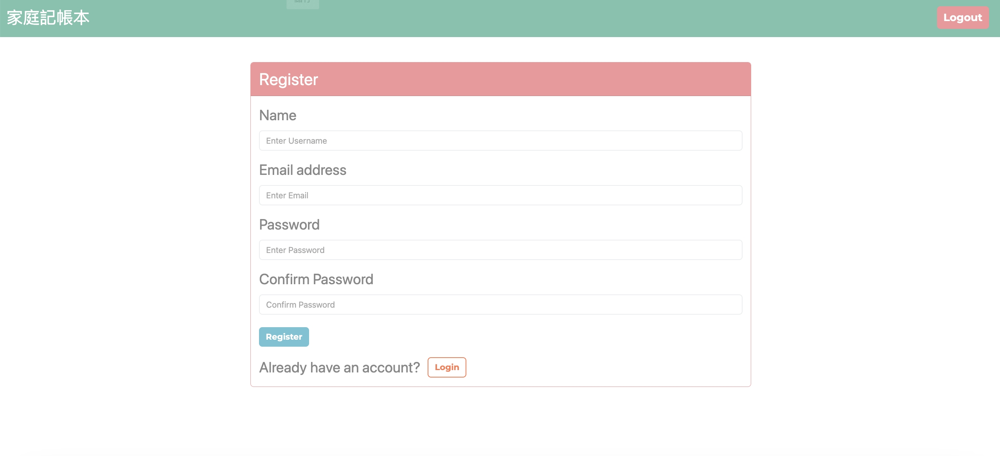

# My Expenses Tracker
This is an expenses tracker application that allows users to easily browse expenses records, filter expenses by category, and summarize the expenses by each category.
## Features
- Show all expenses on the homepage.
- Choosing the category to filter the expenses.
- Summarize the expenses by each category.
- CRUD function.
- Users can register their own accounts

## Prerequisites
> **Node.js v18.15.0**

> **MySQL v8.0.37**
## Installation
1. Open your terminal and clone the repository :   
    ```sh
    git clone https://github.com/dodoschnau/Expense-tracker.git
    ```

2. Change directory :   
    ```sh
    cd expense-tracker
    ```

3. Install the required npm packages :   
    ```sh
    npm install
    ```

4. Set up your environment variables :

    Create a `.env` file based on the `.env.example` file and fill in your own values:
    ```sh
    cp .env.example .env
    ```

5. Create the database in MySQL :
    ```sh
    CREATE DATABASE expense
    ```
    `Note: Make sure the MySQL server connection settings match those in config/config.json.`

6. Run the database migrations and seeders to set up the initial database structure and data :
    ```sh
    npx sequelize db:migrate
    npm run seed:all
    ```

7. Launch the application :   
    ```sh
    npm run start
    ```
8. Open your browser and visit http://localhost:3000 to start using the program.


## Test account
The seed data provides the following two sets of accounts for use :
> Email：user1@example.com / Pwd：12345678

> Email：user2@example.com / Pwd：12345678

## Development

To run the application in development mod
e with `nodemon` and `cross-env`, use the following command:
```sh
npm run dev:dev
```

## Authentication
### Passport Local Strategy
    
  > Users can register and login with their own email and password.


## Screenshot


